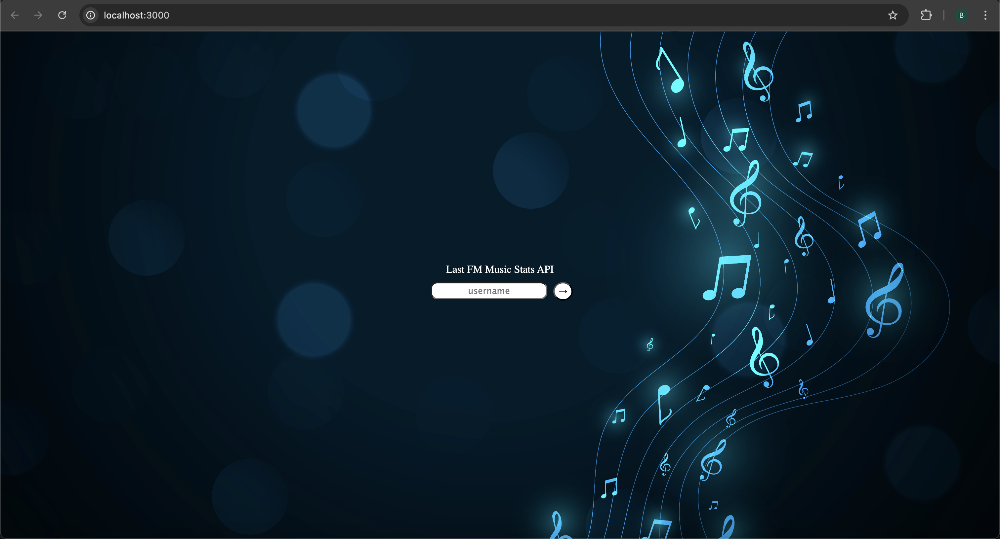
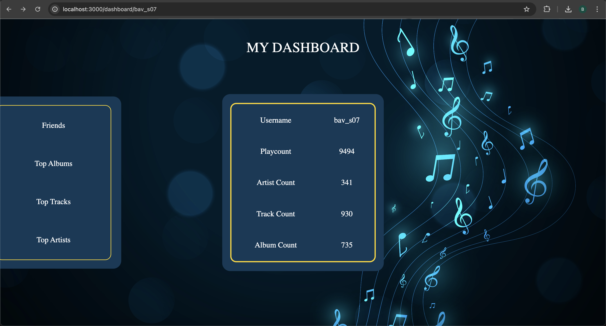
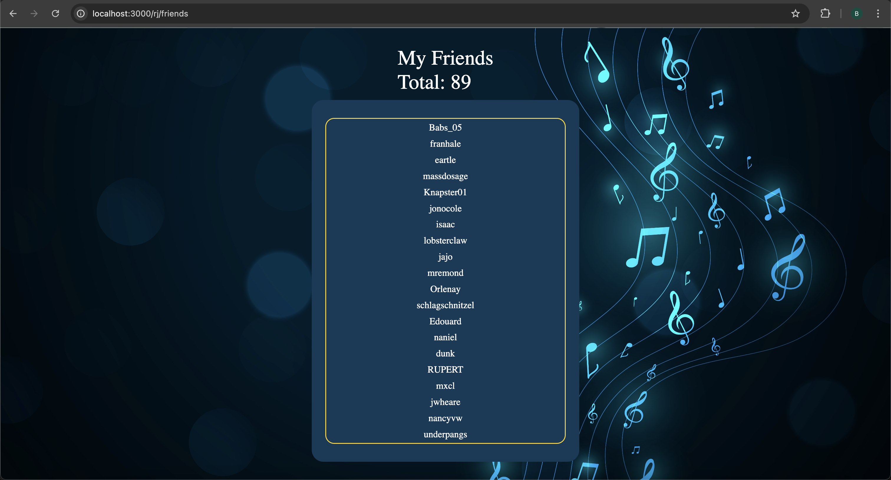
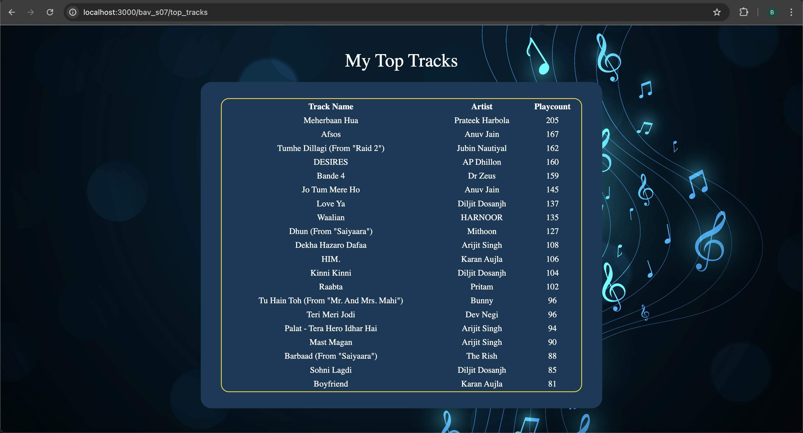
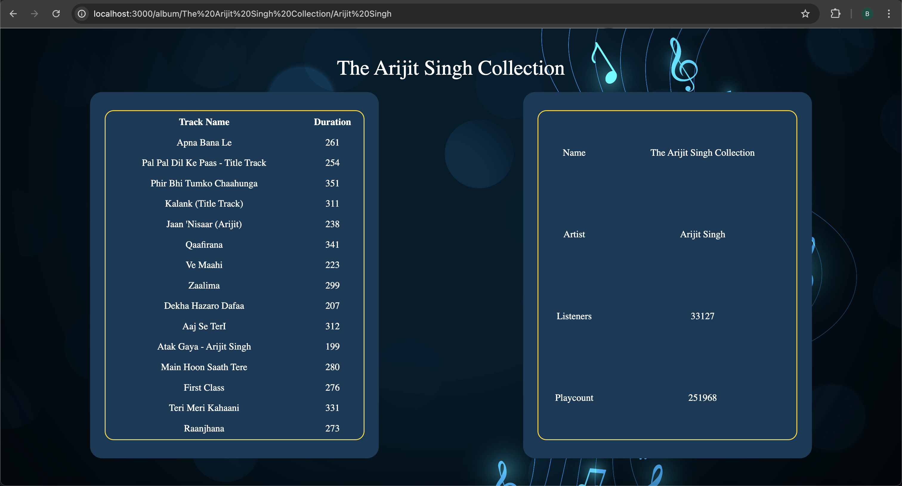
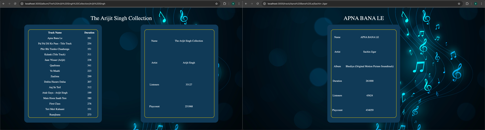

# Last FM Music Stats API

I designed this web application so curious music listeners like myself can discover their most played songs and how often they listen to them. Users can access their personalised list of favourite albums, tracks and artists and access detailed information on each selection. This dynamic application uses HTML/CSS for the frontend, Node.js/Express alongside EJS to manage the middleware and the Last fm API as the backend to retrieve data.

## Features

- Username Search for Last.fm User
- View User Profile and Stats
- View User's Friend List
- Display User's Top Albums
- Display User's Top Tracks
- View Album Information For Top Albums
- View Track List and Stats for Selected Album
- View Song Stats for Selected Song
- View Artist Information
- Generalised and Specific Route Error Handling

## Environmental Variables 

- API_KEY (Generated from Last Fm Website)

## Setup
### Code Setup
1. git clone https://github.com/BavneetSingh07/database-project.git
2. npm install
3. create .env file (containing API_KEY)

### API Setup
1. Visit https://www.last.fm/api/account/create?_pjax=%23content
2. Login/Signup and fill in the form to apply for api
3. Once successful, visit https://www.last.fm/api/accounts (if needed login again)
4. Copy the API key and paste it in .env file as API_KEY=

### Server Startup
**Run the following command in terminal**
```bash
node index.js
```
## Usage

1. Homepage
Users start by entering a Last.fm username in the username form and submitting

2. Dashboard
Users can view user's profile and stats retrieved from Last.fm

3. Friends
Users can view the user's friends list from Last.fm

4. Top Albums
Users can view the user's top 5 albums

5. Top Tracks
Users can view the user's top 20 tracks

6. Top Artists
Users can view the user's top 5 artists

7. Album Information
Users can view the tracklist and details for a selected album

8. Song Information
Users can view details for a selected song

9. Artist Information
Users can view details for a selected artist

## Technologies

- HTML and CSS (For Front-end Development)
- Nodejs (For Backend JavaScript)
- Express (For App Route Management)
- EJS (For Designing Dynamic HTML Pages)
- Dotenv (For Environmental Variable Management)
- Last.fm API - External API to fetch music data

## Screenshots
### Homepage/Dashboard/Friends



### Top Albums/Top Artists/Top Tracks


### Album Information/Song Information/Artist Information



## Future Improvements
- Charts to Represent Data
- Add Navigation Bar for UX
- Add a Previous Page Button For UX
- Add Pagination
- Add Limits
